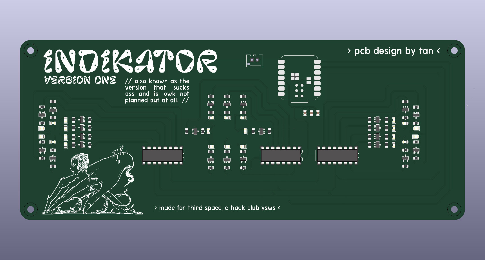
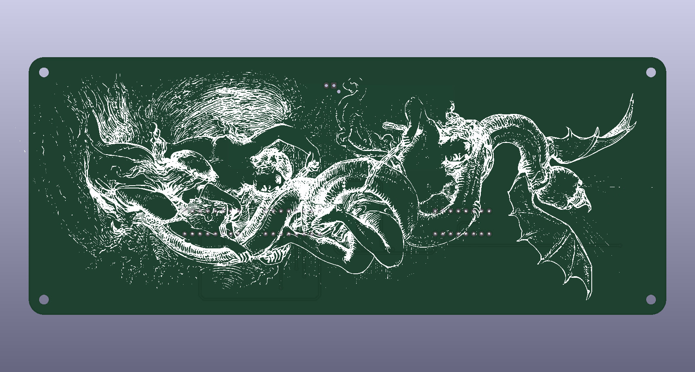

# don't hit me (indikator)

## what is it

don't hit me is a project containing multiple tools/gadgets to aid us during biking. atm there's a handle bar with indicator lights in [the repo dont-hit-me](https://github.com/istoocold/dont-hit-me) and an actual indicator for the seat in this repo. 

there's plans for more stuff like phone holder, some sort of communication between bikes and other stuff maybe.

## features

- indicators on the handle bar that will tell you where your partner is moving.
- indicators for the seat that will allow others to see where you are moving.
- buttons on the handle bar to use the indicator lights.
- using espnow to communicate between the handle bar and the indicators AND the bikes.

## repos

it's currently divided between two repos:
- indikator (this repo)
- dont-hit-me ([https://github.com/istoocold/dont-hit-me](https://github.com/istoocold/dont-hit-me))

## installation

there's no installation needed tbh. just close the repo and open it with kicad. same for the dont-hit-me repo. use freecad for the cad stuff.

## ai usage

we just used chatgpt for asking questions. ai was not used for generating any code or images, etc.
